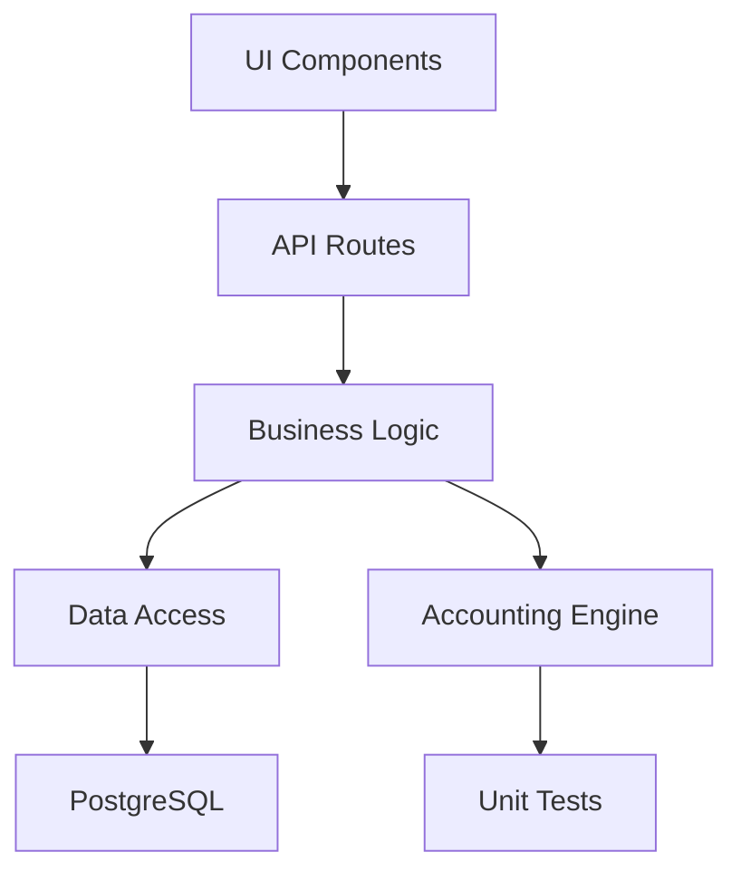

# 技术架构文档

## 1. 系统概述

慧友酒店经营核算平台是一个用于酒店日常经营核算的数字化系统。
第一阶段聚焦于：龙口悦致酒店试点 + 区域运营总监视角。

## 2. 技术架构

```
┌─────────────────────────────────────────────────────────────┐
│                      Next.js App Router                      │
├─────────────────────────────────────────────────────────────┤
│  UI Layer (React Components)                                │
│  ├── Pages: /login, /dashboard, /accounting                │
│  └── Components: shadcn/ui + 业务组件                        │
├─────────────────────────────────────────────────────────────┤
│  API Layer (Route Handlers)                                 │
│  └── REST API: /api/auth, /api/accounting, /api/reports   │
├─────────────────────────────────────────────────────────────┤
│  Business Logic Layer (Pure Functions)                      │
│  └── lib/accounting/ - 独立于 UI 的核算逻辑                  │
├─────────────────────────────────────────────────────────────┤
│  Data Access Layer (Prisma ORM)                             │
│  └── lib/db.ts                                             │
├─────────────────────────────────────────────────────────────┤
│  Database (PostgreSQL)                                      │
└─────────────────────────────────────────────────────────────┘
```

## 3. 核心模块

### 3.1 认证模块 (lib/auth/)
- 用户登录/登出
- Session 管理
- 密码验证
- RBAC 权限控制

### 3.2 核算模块 (lib/accounting/)
- **核心原则**: 纯函数，无副作用，独立于 UI
- 日核算计算
- 区域汇总计算
- 异常检测

### 3.3 数据模块 (lib/data/)
- Excel 导入解析
- 数据校验
- 审计日志

## 4. 数据库设计原则

### 4.1 设计约束
- **禁止**: 直接映射 Excel Sheet 为数据库表
- **必须**: 基于业务实体设计数据模型
- **必须**: 保留完整审计历史

### 4.2 核心数据模型

```
Hotel (酒店)
├── id, name, code, region, status

DailyAccounting (日核算记录)
├── id, hotelId, date
├── inputs: 各项输入数据
├── outputs: 计算结果
└── audit: 创建人, 更新时间, 状态

RegionSummary (区域汇总)
├── id, regionId, date
├── hotelIds: 关联酒店列表
├── summary: 汇总数据
└── status: 待审/已审

AuditLog (审计日志)
├── id, entityType, entityId
├── action, oldValue, newValue
└── operatorId, timestamp
```

## 5. 权限模型 (RBAC)

### 角色
| 角色 | 权限 |
|------|------|
| 店长 | 门店核算填报、查看本门店数据 |
| 区域运营总监 | 查看区域汇总、审核、导出 |
| 系统管理员 | 全局配置、用户管理 |

### 路由权限
| 路由 | 店长 | 区域总监 | 管理员 |
|------|------|----------|--------|
| /login | ✓ | ✓ | ✓ |
| /dashboard | ✓(本门店) | ✓(本区域) | ✓ |
| /accounting/:hotelId | ✓(本门店) | ✓ | ✓ |

## 6. 项目结构

```
yunying/
├── prisma/
│   └── schema.prisma          # 数据库 Schema
├── src/
│   ├── app/
│   │   ├── (auth)/
│   │   │   └── login/
│   │   ├── (dashboard)/
│   │   │   ├── layout.tsx
│   │   │   ├── page.tsx
│   │   │   └── accounting/
│   │   └── api/
│   │       └── [...slug]/
│   ├── components/
│   │   ├── ui/                # shadcn/ui
│   │   └── business/          # 业务组件
│   ├── lib/
│   │   ├── db.ts
│   │   ├── auth/
│   │   ├── accounting/        # 核心计算逻辑
│   │   └── excel/             # Excel 解析
│   ├── middleware.ts
│   └── types/
├── tests/
│   └── accounting/
├── docs/
│   ├── architecture.md
│   ├── business-rules.md
│   ├── data-dictionary.md
│   └── decision-log.md
└── package.json
```

## 7. 依赖关系



## 8. 已知限制

- 第一阶段仅支持单酒店（龙口悦致）+ 区域汇总
- 暂不支持 PMS/OTA 对接
- 暂不支持多集团架构

## 9. 待确定事项

TODO: Excel 业务规则待分析（需提供龙口悦致.xlsx和运营部日核算表.xlsx）
TODO: 具体的核算公式需要从 Excel 中提取
TODO: 区域划分规则待确认
